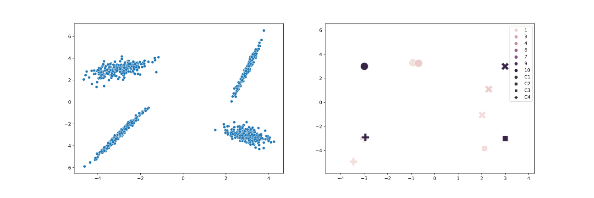

# ML algorithms 

This repository contains the below listed ML and deep learning algorithms implemented from scratch using Python, numpy arrays or Tensors. Matrix operation is used mostly to make the models efficient and fast.
- Linear Regression
- Logistic regression
- Naive Bayes
- KNN
- K-Means clustering
- Neural Networks
- Transformer Encoder only model (BERT)

Results from the K Means clustering ( refer the notebook for implementation details)
The figure on the left displays the actual training data with four clusters. The figure on the right illustrates the algorithm's convergence over iterations. Centroids, represented by each shape corresponding to one cluster (or K), are initialized randomly. In the right figure, the lightest color represents the first iteration, and the darkest color represents the final iteration, showing how the centroids of the clusters converge towards the center compared to the actual data on the left.

Also, cool project, loss surfaces

